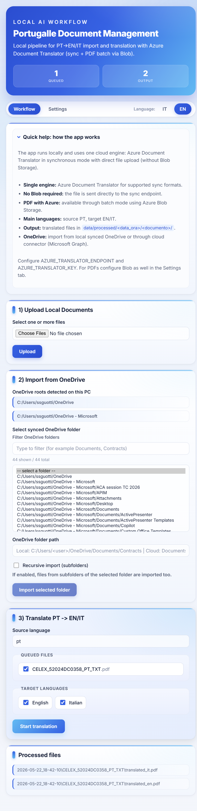

# Portugalle Document Management

Portugalle Document Management is a local-first document workflow application for importing, queuing, and translating files from Portuguese (`pt`) into English (`en`) and Italian (`it`) using Azure Document Translator.

The application is designed for practical day-to-day operations:
- Local input/output folder workflow.
- OneDrive local sync import (no App Registration required).
- Azure sync translation for supported formats.
- Azure batch + Blob workflow for PDF files.
- Bilingual UI and runtime messages (Italian/English).

## Screenshot



## Key Capabilities

- Upload files directly from the local machine.
- Import files from synced OneDrive folders discovered automatically.
- Process queued files into one or multiple target languages.
- Preserve a timestamped output history under `data/processed/`.
- Configure translator and Blob settings from the UI (`Settings` tab).
- Lock settings changes for production-like environments.

## Solution Architecture

- UI and API: FastAPI + Jinja2.
- Sync translation endpoint:
  - `POST /translator/document:translate`
  - API version: `2024-05-01`
- PDF translation endpoint:
  - `POST /translator/document/batches`
  - API version: `2024-05-01`
- Storage model:
  - Input queue: `data/incoming/input_doc`
  - Output archive: `data/processed/<YYYY-MM-DD_HH-MM-SS>/...`
  - Azure Blob is used as a temporary bridge for PDF batch translation.

## Supported File Types

- Sync translation route:
  - `.txt`, `.tsv`, `.tab`, `.csv`, `.html`, `.htm`, `.mhtml`, `.mht`, `.pptx`, `.xlsx`, `.docx`, `.msg`, `.xlf`
- Batch translation route:
  - `.pdf`

## Prerequisites

- Windows + PowerShell.
- Python 3.11 or later.
- Azure Translator resource (custom domain endpoint + key).
- Azure Storage Account (required for PDF batch translation):
  - Blob connection string
  - Source container
  - Target container

## Quick Start

1. Configure required environment variables in PowerShell:

```powershell
$env:AZURE_TRANSLATOR_ENDPOINT = "https://<resource-name>.cognitiveservices.azure.com"
$env:AZURE_TRANSLATOR_KEY = "<translator-key>"
```

2. Start the application:

```powershell
.\run_local.ps1
```

3. Open the UI:

```text
http://127.0.0.1:8000
```

## Configuration Reference

| Variable | Required | Description |
|---|---|---|
| `TRANSLATION_BACKEND` | Optional | Backend selector (default flow uses Azure document translation). |
| `AZURE_TRANSLATOR_ENDPOINT` | Yes | Translator endpoint (custom domain). |
| `AZURE_TRANSLATOR_KEY` | Yes | Translator key. |
| `AZURE_TRANSLATOR_API_VERSION` | Optional | Sync API version (default `2024-05-01`). |
| `AZURE_TRANSLATOR_TIMEOUT_SEC` | Optional | Sync request timeout (default `600`). |
| `AZURE_BLOB_CONNECTION_STRING` | PDF only | Full Blob connection string. |
| `AZURE_BLOB_SOURCE_CONTAINER` | PDF only | Source Blob container for PDF batch input. |
| `AZURE_BLOB_TARGET_CONTAINER` | PDF only | Target Blob container for PDF batch output. |
| `AZURE_TRANSLATOR_BATCH_API_VERSION` | Optional | Batch API version (default `2024-05-01`). |
| `AZURE_TRANSLATOR_BATCH_TIMEOUT_SEC` | Optional | Batch timeout in seconds (default `1800`). |
| `AZURE_TRANSLATOR_BATCH_POLL_SEC` | Optional | Batch polling interval in seconds (default `5`). |
| `LOCK_TRANSLATOR_SETTINGS` | Optional | If set to `1`, disables Settings updates from UI. |
| `ONEDRIVE_CONNECTOR_MODE` | Optional | `local-sync` (default) or `graph`. If omitted, `graph` is auto-enabled when all Graph settings exist. |
| `ONEDRIVE_TENANT_ID` | OneDrive cloud | Microsoft Entra tenant ID for Graph token request. |
| `ONEDRIVE_CLIENT_ID` | OneDrive cloud | App registration client ID with Microsoft Graph permissions. |
| `ONEDRIVE_CLIENT_SECRET` | OneDrive cloud | Client secret for app registration (store in App Service settings / Key Vault). |
| `ONEDRIVE_USER_ID` | OneDrive cloud | Target OneDrive owner (UPN or Entra object ID). |
| `MS_OAUTH_CLIENT_ID` | OneDrive delegated | OAuth client ID for Microsoft sign-in (solution for personal account login). |
| `MS_OAUTH_CLIENT_SECRET` | OneDrive delegated | OAuth client secret for authorization code flow. |
| `MS_OAUTH_TENANT` | OneDrive delegated | OAuth tenant segment (`common` recommended for public login). |
| `MS_OAUTH_REDIRECT_URI` | OneDrive delegated | Optional explicit callback URL. If missing, app builds `/auth/microsoft/callback` from current host. |
| `MS_OAUTH_SCOPES` | OneDrive delegated | Optional scope override (default includes `Files.Read`). |

## OneDrive Import (Local Sync Mode)

This mode imports documents from folders already synced by the OneDrive desktop client.

- No Graph API usage.
- No MSAL flow.
- No Azure Entra App Registration required.

Path discovery sources include:
- Environment variables (`OneDrive`, `OneDriveConsumer`, `OneDriveCommercial`).
- Windows Registry (`HKCU\Software\Microsoft\OneDrive`, Personal/Business accounts).
- Common Windows user folders (`C:/Users/*/OneDrive*`).

Imported files are copied into `data/incoming/input_doc` and become immediately available for translation.

## OneDrive Import (Cloud Connector on Azure)

When the app is hosted on App Service, local synced folders are not available. Enable the cloud connector:

1. Configure app settings:
  - `ONEDRIVE_CONNECTOR_MODE=graph`
  - `ONEDRIVE_TENANT_ID=<tenant-guid>`
  - `ONEDRIVE_CLIENT_ID=<app-client-id>`
  - `ONEDRIVE_CLIENT_SECRET=<client-secret>`
  - `ONEDRIVE_USER_ID=<user-upn-or-object-id>`
2. Grant Microsoft Graph application permissions for the app registration (for example `Files.Read.All`) and grant admin consent.
3. In the UI, select a folder from discovered cloud paths or enter a cloud path manually (for example `Documents/Contracts`).

Notes:
- `local-sync` remains the recommended mode for developer workstation usage.
- `graph` mode is recommended for App Service and any hosted/public deployment.

## OneDrive Import (Delegated OAuth - Personal Accounts)

Use this mode when the app must work with personal Microsoft accounts and interactive sign-in.

1. Configure app settings:
  - `ONEDRIVE_CONNECTOR_MODE=delegated`
  - `MS_OAUTH_CLIENT_ID=<oauth-client-id>`
  - `MS_OAUTH_CLIENT_SECRET=<oauth-client-secret>`
  - `MS_OAUTH_TENANT=common`
2. Configure redirect URI in App Registration:
  - `https://<your-app>.azurewebsites.net/auth/microsoft/callback`
3. Sign in from the app UI using **Connect OneDrive**.

Delegated mode is the recommended option for public SaaS scenarios where each user accesses their own OneDrive.

OneDrive picker UX includes:
- Live folder filtering in the select panel.
- Visible counters for filtered vs total detected folders.
- Scrollable bounded list for better usability with large folder sets.

## UI and Localization

- App UI supports Italian and English.
- Runtime success/error messages follow the selected UI language.
- Language selection is preserved across tabs and post/redirect workflows.

## Security and Production Guidance

If the app is exposed beyond local development:
- Set `LOCK_TRANSLATOR_SETTINGS=1`.
- Manage secrets through server-side environment variables or a dedicated secret manager.
- Ensure `data/settings/translator_settings.json` is never publicly exposed.
- Use HTTPS and authentication in front of the application.

## Repository Layout

- `app/main.py`: FastAPI routes, orchestration, UI wiring, localization handling.
- `app/azure_document_translator.py`: Azure sync translation client.
- `app/azure_pdf_batch_translator.py`: PDF batch workflow (upload, submit, poll, download).
- `app/format_preserving_translation.py`: format-aware dispatch logic.
- `app/onedrive_connector.py`: OneDrive path discovery and local import.
- `app/settings_store.py`: settings persistence and effective config resolution.
- `app/templates/index.html`: main Jinja2 template.
- `app/static/style.css`: UI styles.
- `run_local.ps1`: local bootstrap/start script.

## Operational Checklist

- Health check: `GET /health`.
- Validate Translator endpoint/key if translations fail.
- Validate Blob configuration for any PDF workflow issue.
- Ensure Blob configuration uses a full connection string (`AccountName` + `AccountKey`), not a Blob URL.
